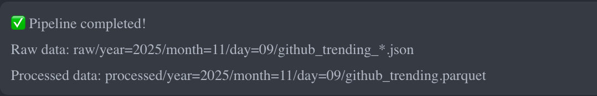
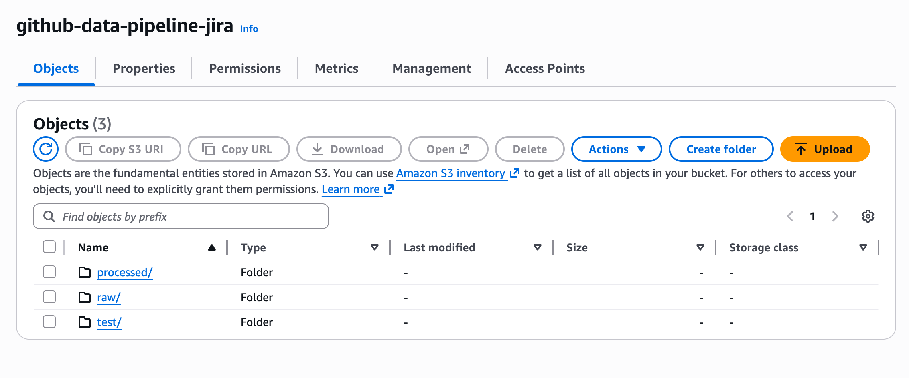
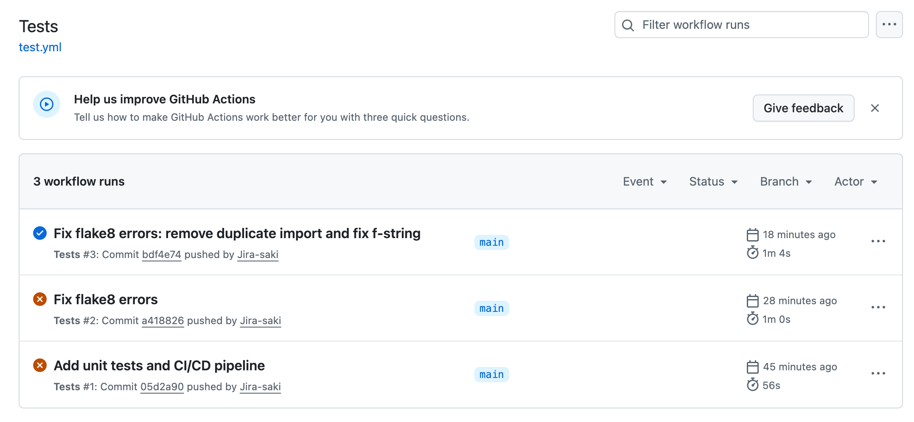

# GitHub Trending Repos Data Pipeline

A production-ready data engineering pipeline that tracks trending GitHub repositories using Prefect orchestration and AWS services.

## 🎯 Project Overview

This pipeline demonstrates:
- **API Integration**: Fetch trending repositories from GitHub API
- **Data Transformation**: Convert nested JSON to structured Parquet format
- **Cloud Storage**: Store raw and processed data in AWS S3 with date partitioning
- **Workflow Orchestration**: Automated pipeline using Prefect
- **Scalable Architecture**: Ready for deployment on AWS ECS Fargate

## 🏗️ Architecture

```
GitHub API
    ↓
Prefect Flow (Orchestration)
    ↓
├── Extract: Fetch trending repos
├── Load: Save raw JSON to S3
├── Transform: Flatten and clean data
└── Load: Save Parquet to S3
```

**Data Flow:**
```
s3://bucket/
├── raw/year=YYYY/month=MM/day=DD/*.json
└── processed/year=YYYY/month=MM/day=DD/*.parquet
```

## 🚀 Features

- ✅ Automated data ingestion from GitHub API
- ✅ Date-based partitioning for efficient querying
- ✅ Data quality checks and cleaning
- ✅ Retry logic and error handling
- ✅ Parquet format for optimized storage
- ✅ Ready for production deployment

## �  Screenshots

### Pipeline Execution


### S3 Bucket Structure


### GitHub Actions CI/CD


## 📁 Project Structure

```
.
├── src/
│   ├── api_client.py      # GitHub API client
│   ├── storage.py         # S3 storage operations
│   ├── transform.py       # Data transformation
│   └── config.py          # Configuration management
├── flows/
│   └── github_pipeline.py # Prefect flow definition
├── tests/
│   └── test_*.py          # Unit tests
├── .env.example           # Environment variables template
├── requirements.txt       # Python dependencies
└── README.md
```

## 🛠️ Setup

### Prerequisites

- Python 3.11+
- AWS Account with S3 access
- GitHub Personal Access Token
- (Optional) Prefect Cloud account

### Installation

1. **Clone the repository**
```bash
git clone https://github.com/yourusername/github-data-pipeline.git
cd github-data-pipeline
```

2. **Create virtual environment**
```bash
python -m venv venv
source venv/bin/activate  # On Windows: venv\Scripts\activate
```

3. **Install dependencies**
```bash
pip install -r requirements.txt
```

4. **Configure environment variables**
```bash
cp .env.example .env
# Edit .env with your credentials
```

5. **Set up AWS credentials**
- Create S3 bucket
- Configure IAM user with S3 access
- Add credentials to `.env`

6. **Get GitHub token**
- Go to https://github.com/settings/tokens
- Generate token with `public_repo` scope
- Add to `.env`

## 🏃 Usage

### Run Pipeline Locally

```bash
python flows/github_pipeline.py
```

### Run with Custom Parameters

```python
from flows.github_pipeline import github_pipeline

github_pipeline(
    language="python",  # or "javascript", "go", etc.
    days_back=7        # repos created in last 7 days
)
```

## 📊 Data Schema

### Raw Data (JSON)
Stored in: `s3://bucket/raw/year=YYYY/month=MM/day=DD/`

### Processed Data (Parquet)
Stored in: `s3://bucket/processed/year=YYYY/month=MM/day=DD/`

**Columns:**
- `repo_id`: Repository ID
- `repo_name`: Repository name
- `full_name`: Owner/repo name
- `owner_login`: Owner username
- `stars`: Star count
- `forks`: Fork count
- `language`: Primary language
- `description`: Repository description
- `created_at`: Creation timestamp
- `updated_at`: Last update timestamp
- `extracted_at`: Data extraction timestamp
- `url`: Repository URL

## 🚢 Deployment Options

### Option 1: AWS EC2
- Simple deployment
- Fixed monthly cost
- Good for learning

### Option 2: AWS ECS Fargate (Recommended)
- Serverless containers
- Pay per use
- Auto-scaling
- Production-ready

### Option 3: Prefect Cloud + AWS
- Managed orchestration
- Easy monitoring
- Scheduling UI

## 🧪 Testing

```bash
# Test API client
python test_connection.py

# Test S3 storage
python test_s3.py

# Test transformation
jupyter notebook transform_practice.ipynb
```

## 📈 Future Enhancements

- [ ] Add Terraform for infrastructure as code
- [ ] Implement data quality tests
- [ ] Add multiple language support
- [ ] Create Athena tables for querying
- [ ] Add email/Slack notifications
- [ ] Implement incremental loading
- [ ] Add data visualization dashboard

## 🤝 Contributing

Contributions are welcome! Please feel free to submit a Pull Request.

## 📝 License

This project is licensed under the MIT License.

## 👤 Author

- GitHub: [@Jira-saki](https://github.com/Jira-saki)
- LinkedIn: [LinkedIn](https://linkedin.com/in/jira-saki)

## 🙏 Acknowledgments

- GitHub API for providing data
- Prefect for workflow orchestration
- AWS for cloud infrastructure